<p align="center">
  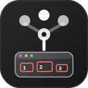
</p>

<h1 align="center">Super Browser Agent</h1>

<p align="center">
  <strong>Interactive comparison tasks · shadcn-style browser agent · 8-section replay</strong>
</p>

<p align="center">
  <a href="#quick-start">Quick start</a> ·
  <a href="#why-browser">Why browser</a> ·
  <a href="#demo-queries">Demo queries</a> ·
  <a href="#replay">Replay</a>
</p>

<p align="center">
  <a href="https://www.youtube.com/watch?v=Mw_K2m_V4sQ"><strong>Watch the YouTube demo</strong></a>
</p>

A browser-first agent stack for **comparison tasks** that `web_search` and `fetch_url` cannot do: JS-rendered pages, filters, dropdowns, tabs, forms, and multi-step flows. The UI now uses a clean shadcn-style zinc browser-agent mark: a minimal browser window, cursor, and small action spark. The browser skill picks the cheapest correct path, tries reusable deterministic site/task adapters for known complex pages, then falls back to a11y/vision control. Distiller + critic + formatter produce structured output; the replay viewer captures full evidence.

## Quick start

```bash
uv sync
cp .env.example .env   # GEMINI_API_KEY
./scripts/serve.sh     # installs Playwright Chromium if missing, then starts uvicorn
uv run python scripts/browser/seed_browser_sessions.py
```

Open **http://127.0.0.1:8080/** — the UI runs a **Playwright launch check** on load (amber banner if Chromium is missing). Check **http://127.0.0.1:8080/health** shows `"playwright_chromium": true`. Always start with `./scripts/serve.sh` (not bare `uvicorn`).

| Action | Where |
|--------|--------|
| Primary comparison | **COMP** (Hugging Face top-3 by likes) |
| Other comparison picks | **DEAL**, **TICKET**, **STACK**, **FORGE** in Tasks sidebar |
| Cascade lab | **B1**–**B4** |
| Replay report (8 sections) | Auto-opens after browser run; or Tasks → **Open COMP replay demo** |

```bash
uv run python scripts/dag/run_query.py COMP
uv run python scripts/browser/export_browser_replay.py dag_COMP_ref -o replay.md
```

## Why browser

| Tool | Good for | Fails on |
|------|----------|----------|
| `web_search` / `fetch_url` | Static articles, docs | JS-rendered UI, click-revealed widgets |
| **Browser skill** | Filters, sort, tabs, forms, product cards | Captcha walls (`blocked` → recover or report) |

Comparison tasks require **≥3 visible browser actions** (search, filter, sort, open detail pages, etc.). Passive search snippets alone do not count.

## Browser Cascade

Cheapest correct path wins:

| Layer | When it wins |
|-------|--------------|
| **Extract** | Static HTML (httpx + trafilatura; Playwright render fallback) |
| **Deterministic adapters** | Known complex task families with stable DOM evidence: Hugging Face models, Amazon product extraction, GitHub Trending, UrbanPro CAD/CAM listings |
| **A11y** | Unknown interactive pages with usable accessibility/text controls |
| **Vision** | Canvas-only / adversarial UI (**B4**) |
| **Blocked** | Live captcha wall — replan or report |

Optional upstream: [browser-use](https://github.com/browser-use/browser-use) — `uv sync --extra browser-use` (runs before local Playwright cascade). See [`docs/BROWSER.md`](docs/BROWSER.md).

## Demo queries

Video walkthrough: [YouTube demo](https://www.youtube.com/watch?v=Mw_K2m_V4sQ) · Full catalog: `corpus/dag/ASSIGNMENT.json` · [`docs/BROWSER.md`](docs/BROWSER.md)

| Id | Comparison task |
|----|-----------------|
| **COMP** | Top 3 Hugging Face text-generation models by likes |
| **DEAL** | 3 laptops under ₹80,000 on Flipkart |
| **STACK** | 5 AI coding tools — free vs paid |
| **FORGE** | 5 CNC/VMC/CAD-CAM training providers — Bangalore |
| **TICKET** | Bonus — GitHub trending repos |
| **B1**–**B4** | Cascade lab (extract → deterministic → a11y → vision) |

### Demo screenshots

| 1 | 2 |
|---|---|
| 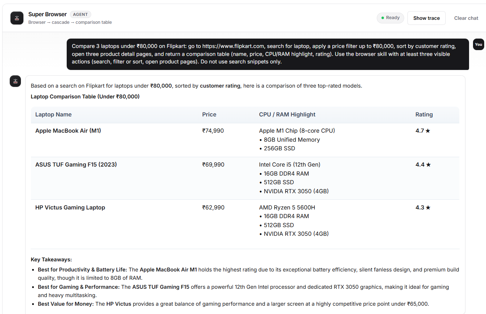 | 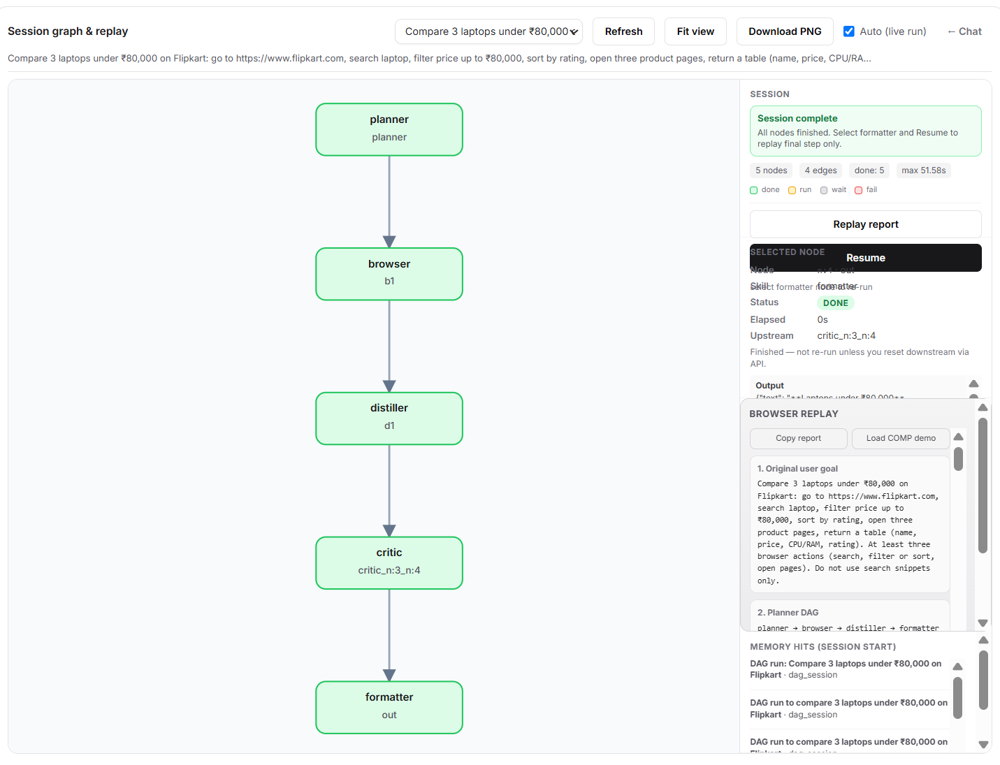 |
| 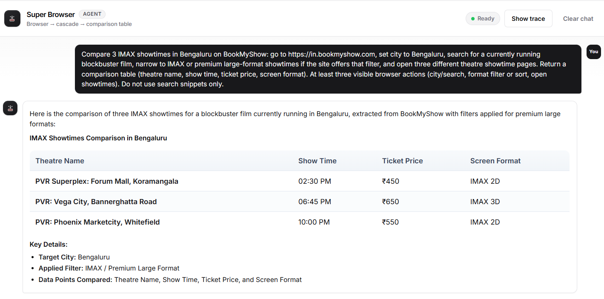 | 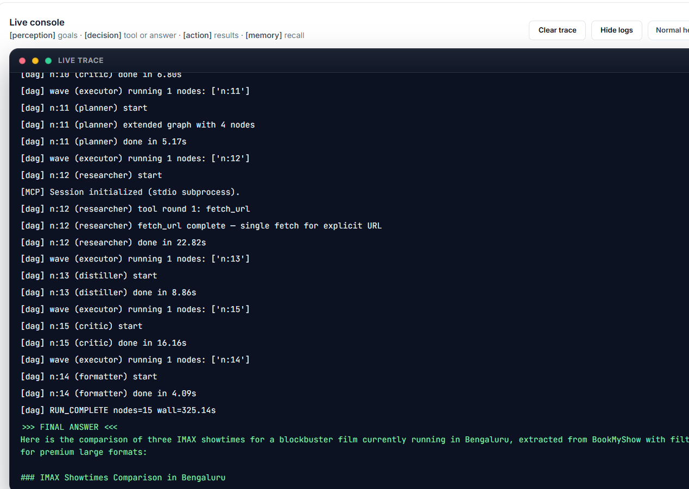 |
| 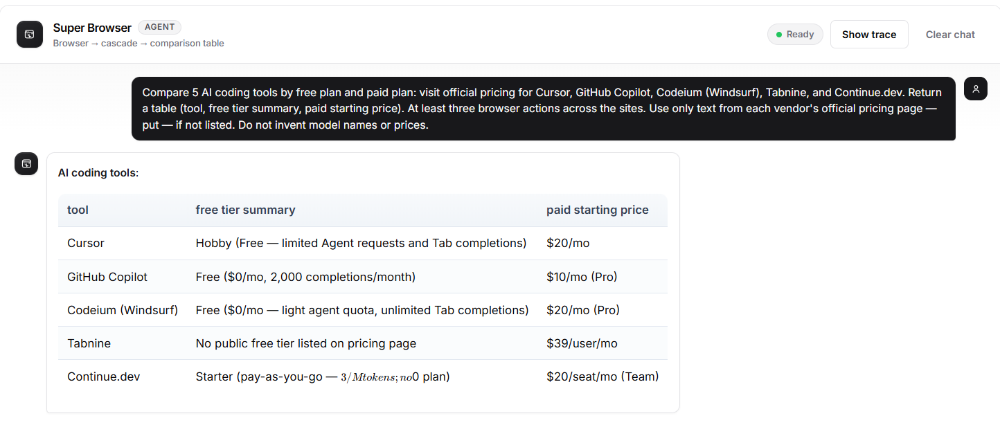 | 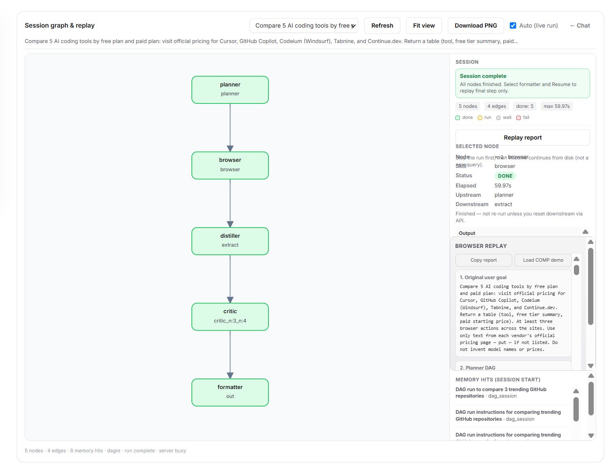 |
| 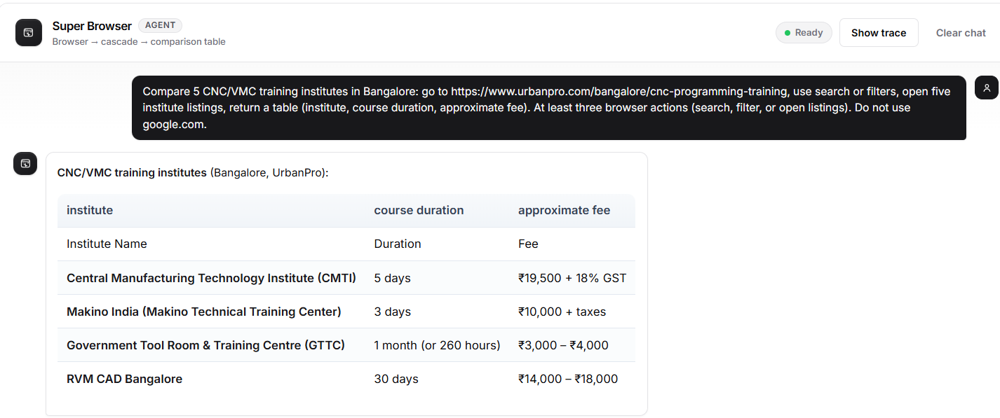 | 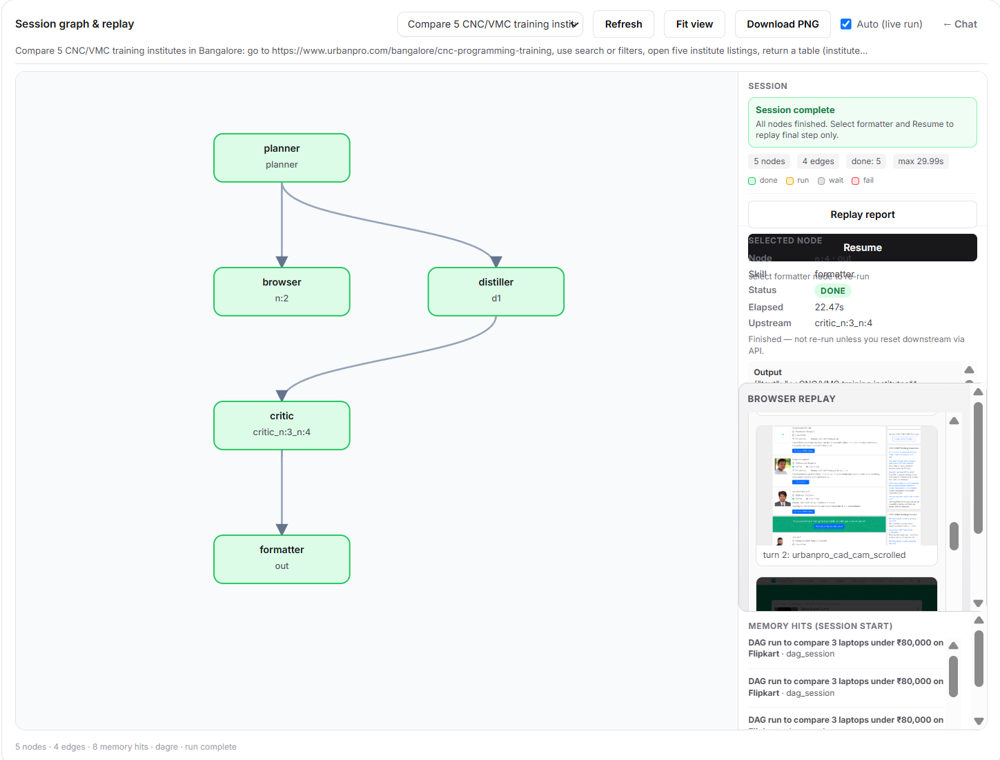 |
| 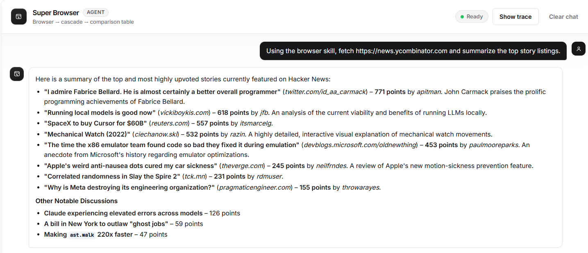 | 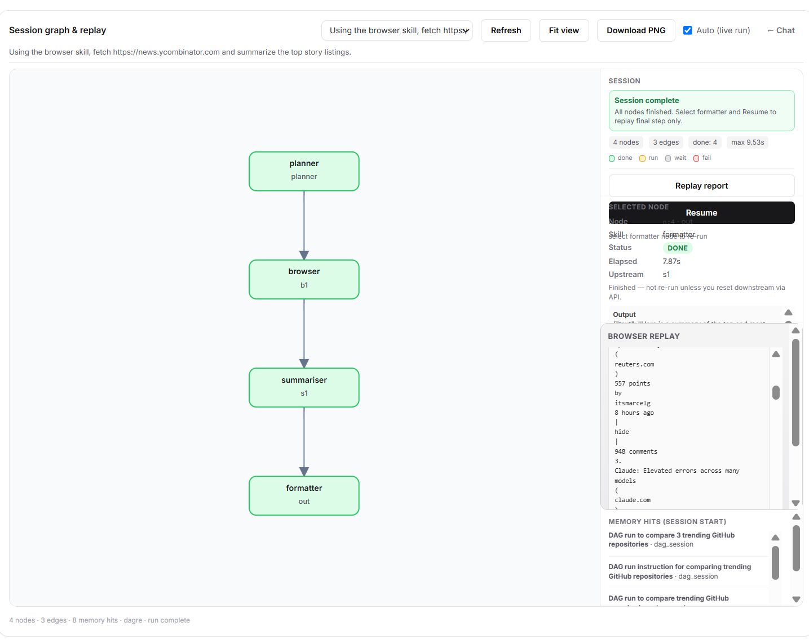 |
| 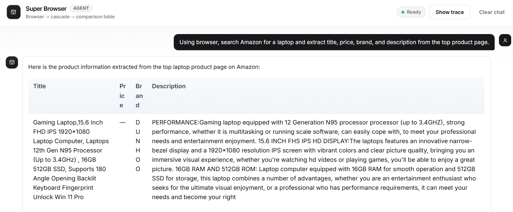 | 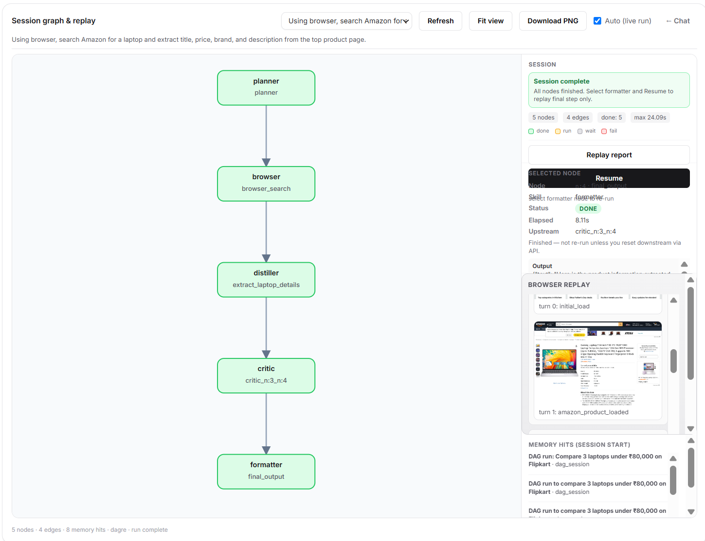 |
| 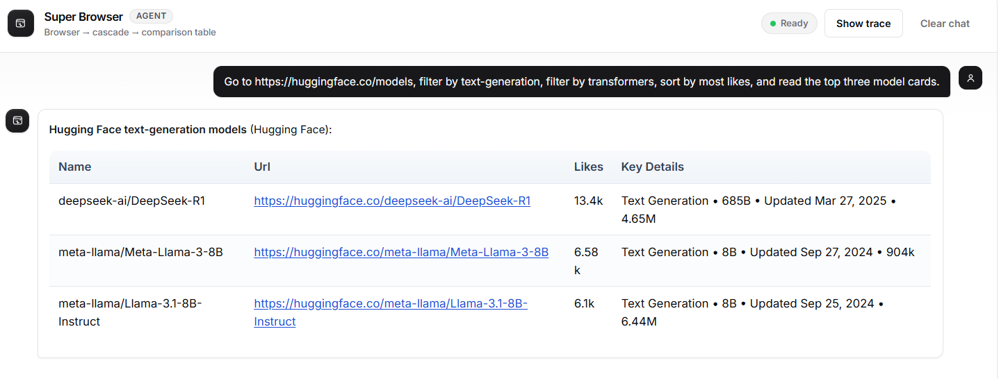 | 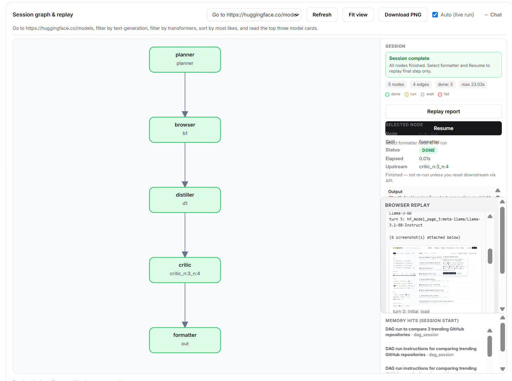 |
| 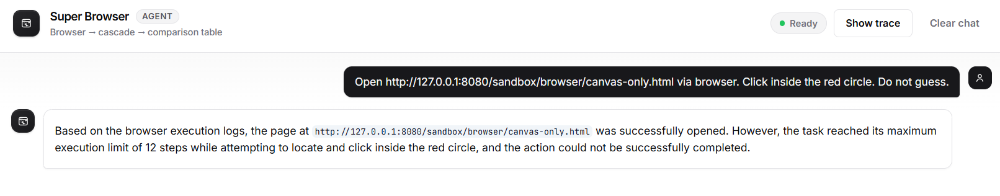 | 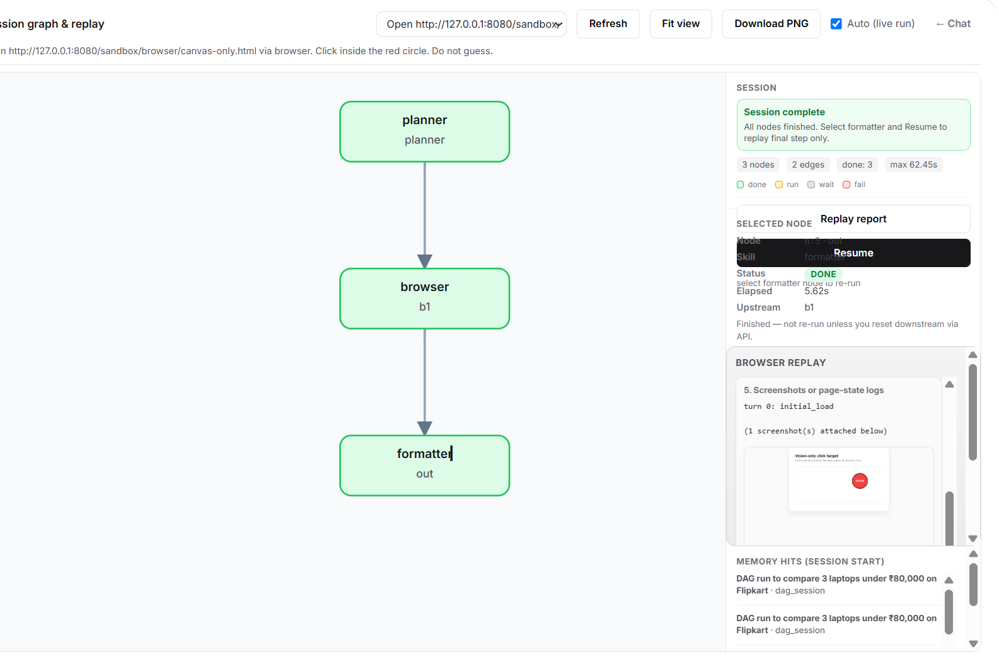 |

## Replay

Eight-section report (Graph UI + export):

1. Original user goal  
2. Planner DAG  
3. Browser path chosen  
4. Browser actions taken  
5. Screenshots or page-state logs  
6. Extracted data  
7. Final comparison table  
8. Turn count and cost summary  

```bash
uv run python scripts/browser/export_browser_replay.py dag_COMP_ref
```

## Architecture

Orchestrator (`super_browser/flow.py`) is unchanged. Browser behaviour plugs in via the skill catalogue + `super_browser/browser/`.

```
User goal
    → Planner
    → Researcher (optional — find candidate URLs; browser-failure fallback)
    → Browser skill
         Extract → deterministic adapters → Render/multi-page → A11y → Vision → Blocked
    → Distiller
    → Critic (auto after distiller)
    → Formatter (comparison table)
    → Replay viewer
```

**crawl4ai** is Researcher-only (`fetch_url`, `fetch_urls`, `web_search` fallback). Browser uses **httpx + trafilatura + Playwright + Pillow** plus direct Gemini drivers — see [`docs/BROWSER.md`](docs/BROWSER.md) and [`docs/VALIDATION.md`](docs/VALIDATION.md).

| Piece | Location |
|-------|----------|
| Browser cascade + adapters | `super_browser/browser/skill.py` → `super_browser/browser/drivers/cascade.py` |
| A11y/vision drivers | `super_browser/browser/drivers/interaction.py`, `elements.py`, `marks.py` |
| Replay report | `super_browser/browser/replay.py` |
| Skill catalogue | `agent_config.yaml` + `prompts/browser.md` |
| Task corpus | `corpus/dag/ASSIGNMENT.json` |
| UI shell + shadcn-style inline logo/chat icons | `templates/index.html` |

## Tests

```bash
uv run pytest tests/test_browser.py tests/test_assignment_spec.py tests/test_dag_queries_api.py -q
# Full check used for this refactor:
uv run pytest
```

Latest verification: **268 passed, 1 skipped**.
